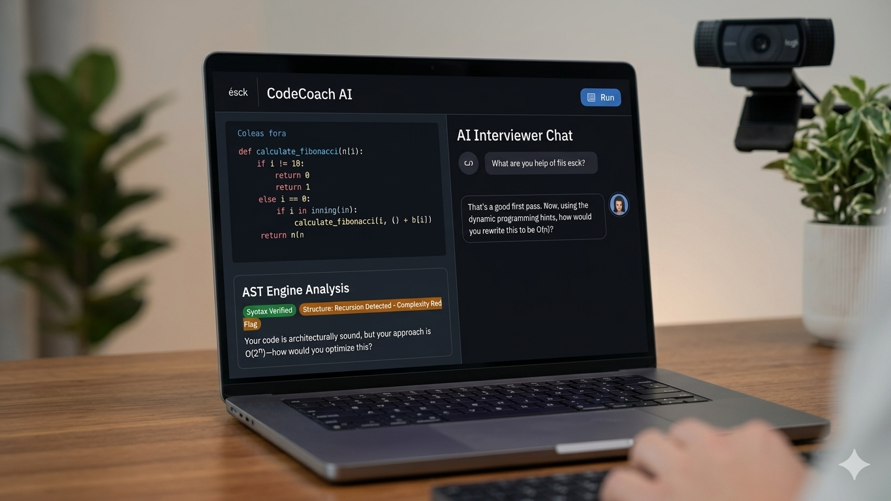

# CodeCoach AI
**Grounded Technical Interview Simulation**

## 🎥 Demo Video
[Watch the CodeCoach AI Demo here](https://youtu.be/5r2LWd1u8sg?si=GHvFg1uLs8yguoc8))

## 🎯 Overview
CodeCoach AI is a next-generation EdTech platform designed to scale elite technical interview preparation. While traditional tools rely on passive solutions or basic text-based AI wrappers that hallucinate, CodeCoach AI pairs a conversational AI interviewer with localized, rigorous backend code compilation.

## 💡 The Solution
CodeCoach AI provides an interactive, live-simulated interview environment:
* **Conversational AI Agent**: Acts as a real tech interviewer—guiding the user through a problem, offering dynamic hints, and probing for optimization.
* **Deterministic Code Engine**: Intercepts the user's Python script locally, parsing it into an Abstract Syntax Tree (AST) to map its architectural skeleton. This ensures that algorithmic constraints and syntax are checked with absolute mathematical certainty.

## 🛠️ Tech Stack
* **Frontend**: Streamlit
* **Analysis**: Python AST (Abstract Syntax Tree)
* **Agent Intelligence**: GPT-4o / OpenAI API

## 🚀 Future Roadmap & Microsoft IQ Integration
Beyond the MVP, we plan to integrate with the **Microsoft IQ** ecosystem. By leveraging shared intelligence across enterprise knowledge graphs, CodeCoach AI will provide hyper-personalized coaching that aligns with specific company coding standards, bridging the gap between practice and professional readiness.

## 🚀 How to Run
1. Clone this repository.
2. Install dependencies: `pip install -r requirements.txt`
3. Run the app: `streamlit run app.py`
